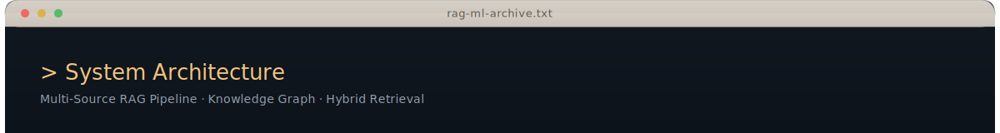
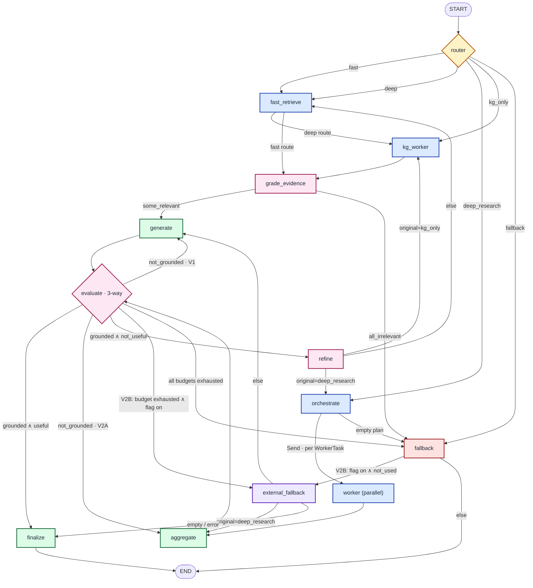
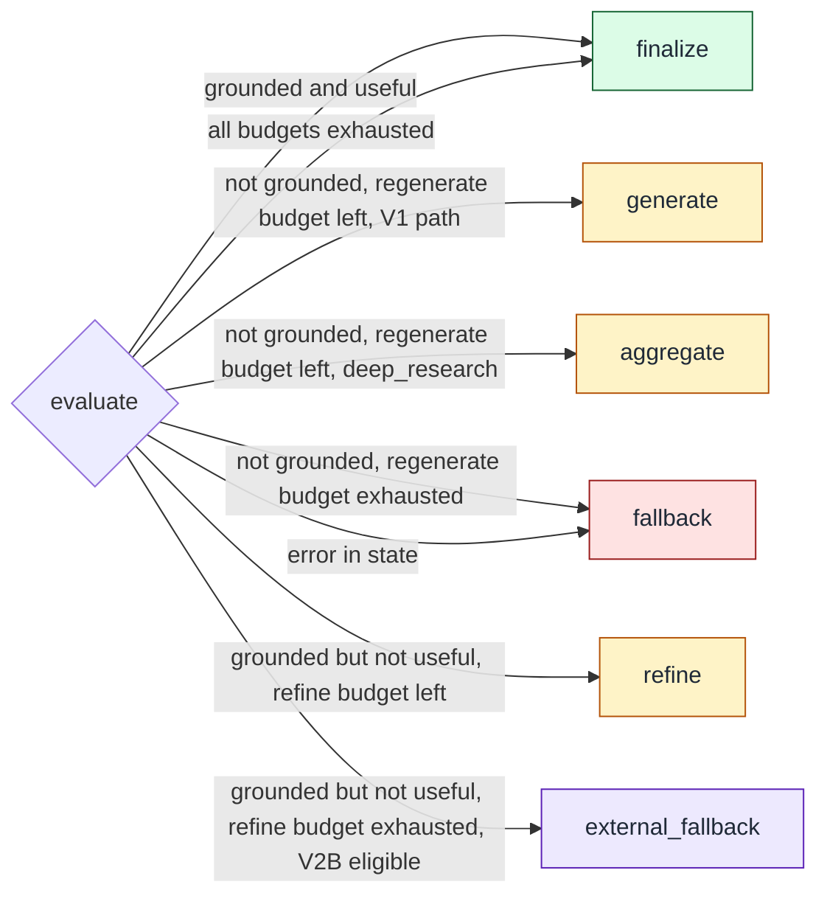
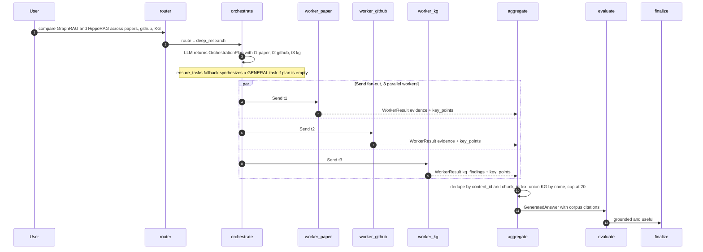
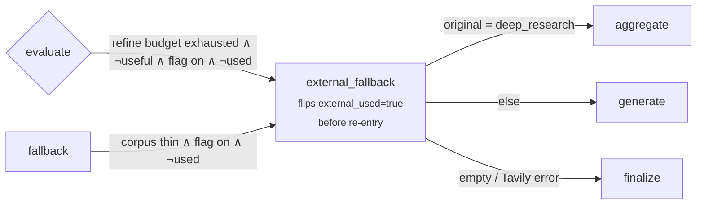

<div align="center">
  
</div>

## Overview

A multi-source Retrieval-Augmented Generation pipeline that ingests AI/ML knowledge from Instagram video transcripts, ArXiv research papers, and GitHub repositories, organizes it into a searchable knowledge system with concept-level understanding, and serves it through a LangGraph-orchestrated agent with a five-path router, parallel per-source workers, a self-reflective evaluator, an opt-in external retriever, async streaming, and online MLflow observability.

Each content source enters through its own ingestion and normalization path and converges into a SQLite store for structured content, FTS5 keyword indexes, and a concept knowledge graph. 768-dimensional sentence-transformer embeddings are served through Databricks Vector Search. Retrieval combines Databricks Vector Search with FTS5 keyword matching through an adaptive weighting system that classifies each query and adjusts strategy at request time. Generation is orchestrated by a LangGraph state machine — every LLM call returns a Pydantic-validated contract, every retrieval is provenance-tagged, every loop is bounded, and every step is traced. All model traffic is routed through a Databricks AI Gateway for cost governance and policy guardrails, and every retrieval, prompt, and agent run is tracked in MLflow against a precision, recall, NDCG, MRR, answer latency, and hallucination-risk evaluation harness.

---

## Technology Stack

<table>
  <tr>
    <td><strong>Languages</strong></td>
    <td>
      
      
      
    </td>
  </tr>
  <tr>
    <td><strong>AI / LLM</strong></td>
    <td>
      
      
      
      
    </td>
  </tr>
  <tr>
    <td><strong>Agent Framework</strong></td>
    <td>
      
      
      
    </td>
  </tr>
  <tr>
    <td><strong>ML / Embeddings</strong></td>
    <td>
      
      
      
      
    </td>
  </tr>
  <tr>
    <td><strong>Platform / LLMOps</strong></td>
    <td>
      
      
      
    </td>
  </tr>
  <tr>
    <td><strong>Data &amp; Storage</strong></td>
    <td>
      
      
      
    </td>
  </tr>
  <tr>
    <td><strong>Web &amp; API</strong></td>
    <td>
      
      
      
      
    </td>
  </tr>
</table>

<br>

## Engineering Principles

### 1. Source-Agnostic Convergence

Every content source — Instagram video transcripts, ArXiv research papers, GitHub repositories — enters through its own specialized ingestion path but converges into a single unified schema (`ai_content`) with normalized metadata. Downstream systems (embedding, search, knowledge extraction, agent retrieval) operate on this unified representation without knowledge of the original source.

> **Goal:** Add a new content source by implementing one collector and one normalizer, with zero changes to retrieval, embedding, knowledge graph, or agent logic.

### 2. Hybrid Retrieval Over Single-Strategy Search

Pure vector search misses exact-match terminology. Pure keyword search misses semantic similarity. The retrieval layer combines Databricks Vector Search (serving 768-dim sentence-transformer embeddings) with SQLite FTS5 keyword matching through an adaptive weighting system that classifies each query (code, factual, conceptual) and adjusts the vector-to-keyword balance in real time. A feedback loop learns optimal weights from user search interactions.

> **Goal:** Every query type — exact code snippets, broad conceptual questions, specific factual lookups — returns relevant results without manual tuning.

### 3. Knowledge-First Architecture

Raw documents are not just stored and embedded — they are distilled into a structured concept graph using LLM-powered extraction. Concepts, their categories (algorithm, model, technique, framework), and weighted relationships form a NetworkX graph that supports centrality analysis, community detection, and concept-aware retrieval. The agent surfaces the graph through a dedicated `kg_only` route and a `kg` worker, rather than as a visualization-only artifact.

> **Goal:** Answer questions about relationships between ideas, not just questions about individual documents.

### 4. Deterministic-Agentic Orchestration

The agent is a **LangGraph state machine**, not a free-form ReAct loop. Every routing decision, every grading verdict, every refinement directive is a strict Pydantic v2 contract validated at the LLM boundary. Every loop has an explicit budget. Every node writes a typed `TraceStep` so the entire run is replayable. Parallel per-source workers fan out via LangGraph's `Send` primitive and merge through reducer-based state channels. The graph is the source of truth — there is no implicit control flow.

> **Goal:** An agent that is auditable, testable, and bounded by an explicit graph rather than implicit control flow.

### 5. Measurable Retrieval Quality

The system includes an MLflow-tracked evaluation harness that records precision, recall, F1, NDCG, MRR, answer latency, and hallucination-risk scores across prompt and retrieval versions. Test queries are generated programmatically from knowledge graph concepts, ensuring evaluation coverage tracks the actual knowledge base, and every evaluation run **plus every live agent invocation** is logged as an MLflow experiment so regressions are caught before they ship.

> **Goal:** Every retrieval and agent change is measured against a reproducible, versioned benchmark — not validated by subjective impression.

### 6. Governed and Cost-Efficient LLM Integration

All LLM calls — agent routing, evidence grading, generation, hallucination grading, answer grading, refinement, orchestration, worker analysis, aggregation, concept extraction, summarization — are routed through a Databricks AI Gateway that enforces policy guardrails, centralizes cost governance across models, and captures per-request telemetry for downstream MLflow tracking. Summarization additionally uses the Claude Message Batches API (up to 100 items per batch, asynchronous polling), achieving approximately 50% cost reduction compared to sequential API calls. OCR uses Mistral AI for PDF text extraction with automatic chunking for large documents and PyPDF2 fallback for robustness. Bypassing the gateway requires the explicit `ALLOW_LOCAL_FALLBACK=true` flag and is audited through a fallback counter.

> **Goal:** Process large document collections at scale with predictable spend, auditable policy enforcement, and zero silent governance bypass.

---

## Pipeline Architecture

The system operates as a seven-layer pipeline. Data flows from collection through processing, storage, knowledge extraction, and embedding before reaching the retrieval and generation layers — and is served by a LangGraph agent on top.

```
┌─────────────────────────────────────────────────────────────────────────┐
│                           Data Collection                               │
│   Instagram (instaloader)  ·  ArXiv (arxiv API)  ·  GitHub (REST API)   │
└────────────────────────────────┬────────────────────────────────────────┘
                                 │
┌────────────────────────────────▼────────────────────────────────────────┐
│                          Data Processing                                │
│   Whisper Transcription  ·  Mistral OCR  ·  Claude Batch Summaries      │
└────────────────────────────────┬────────────────────────────────────────┘
                                 │
┌────────────────────────────────▼────────────────────────────────────────┐
│                        SQLite Unified Store                             │
│   ai_content  ·  source-specific tables  ·  FTS5 virtual tables         │
└───────────┬────────────────────┬────────────────────┬───────────────────┘
            │                    │                    │
┌───────────▼──────┐  ┌─────────▼──────────┐  ┌──────▼──────────────────┐
│  Knowledge       │  │  Databricks         │  │  Hybrid Retrieval        │
│  Extraction      │  │  Vector Search      │  │  Vector + FTS5 fusion    │
│  Concepts +      │  │  768-dim, overlap   │  │  Adaptive weighting      │
│  Graph           │  │  chunking           │  │  Feedback learning       │
└───────────┬──────┘  └─────────┬──────────┘  └──────┬──────────────────┘
            │                   │                    │
┌───────────▼───────────────────▼────────────────────▼────────────────────┐
│              LLM Response Generation  ·  Databricks AI Gateway          │
│   Context selection  ·  Source citations  ·  Policy guardrails          │
│   Cost governance  ·  MLflow-tracked prompt and retrieval versions      │
└────────────────────────────────┬────────────────────────────────────────┘
                                 │
┌────────────────────────────────▼────────────────────────────────────────┐
│                Agentic Orchestration  ·  LangGraph                      │
│   5-path router · per-source workers · 3-way self-reflection            │
│   bounded refine · external fallback · streaming SSE · MLflow online    │
└─────────────────────────────────────────────────────────────────────────┘
```

<br>

## Multi-Source Ingestion

### Platform Video Pipeline

The scraper uses instaloader with proxy rotation, account credential cycling, and rate-limit detection with configurable cooldown periods. Account state is tracked persistently in JSON files. Audio is extracted and transcribed locally using OpenAI Whisper, producing timestamped transcript segments.

### ArXiv Research Papers

Papers are collected via the arxiv API with configurable search queries and date ranges. PDF text is extracted using the Mistral AI OCR API with automatic chunking for large documents. A PyPDF2 fallback ensures extraction succeeds when the OCR API is unavailable. Papers enter a download-only mode for batch collection, followed by a separate processing phase.

### GitHub Repositories

Public repositories are collected via the GitHub REST API. Repository metadata, README content, file structure, and primary language information are normalized into the unified content schema.

> **Guarantee:** Each source operates independently — an Instagram rate-limit event does not block ArXiv paper processing or GitHub collection. The agent layer reads sources through canonical names (`research_paper`, `github`, `instagram`, `kg`) and tolerates legacy aliases (`arxiv`, `paper`, …) via a Pydantic boundary validator.

---

## Knowledge Graph Engine

The concept extraction pipeline uses Claude to identify concepts from processed content, classify them by category (algorithm, model, technique, framework, concept, tool, dataset, metric), and extract weighted relationships with confidence scores. The resulting graph is built and analyzed using NetworkX.

**Graph capabilities:**
- PageRank centrality analysis for identifying foundational concepts
- Community detection for discovering concept clusters
- Subgraph extraction around specific topics
- Interactive Plotly visualization and static Matplotlib rendering
- GEXF and JSON export for external analysis tools
- First-class agent integration: dedicated `kg_only` router path and `kg` worker type

> **Guarantee:** The knowledge graph is a queryable, structured representation of the knowledge base — surfaced to the agent as a typed `KGFinding` evidence stream, not a visualization artifact.

---

## Hybrid Retrieval System

### Embedding Layer

Text is chunked with configurable size (default 1000 characters) and overlap (200 characters), using intelligent boundary detection that respects paragraph breaks, newlines, sentence endings, and word boundaries. Embeddings are generated using `multi-qa-mpnet-base-dot-v1` (768 dimensions) from sentence-transformers and indexed in a Databricks Vector Search endpoint that serves approximate-nearest-neighbor queries for the retrieval layer. A TF-IDF hash-based fallback activates when the embedding model or the vector endpoint is unreachable, so retrieval degrades gracefully instead of failing.

### Adaptive Search Weighting

The hybrid search layer classifies each query and applies dynamic weights:

| Query Type | Vector Weight | Keyword Weight | Trigger |
| :--- | :--- | :--- | :--- |
| Code queries | 0.50 | 0.50 | Code-like tokens detected |
| Factual queries | 0.60 | 0.40 | Specific entity or fact pattern |
| Conceptual queries | 0.80 | 0.20 | Abstract or relationship question |
| Short queries (1–2 words) | −0.10 adjustment | +0.10 adjustment | Token count ≤ 2 |
| Exact-match (quoted) | −0.20 adjustment | +0.20 adjustment | Quoted phrase detected |

Weights are further refined by a feedback learning loop (`search_query_log`, `search_feedback`, `weight_patterns` tables) that tracks which weight configurations produce the best user-rated results.

> **Guarantee:** Search quality improves over time without manual retuning, driven by observed user interactions.

---

## Agentic Orchestration Layer

A LangGraph state machine that wraps the retrieval, knowledge graph, and generation primitives. Every routing decision is a typed contract, every retrieval is provenance-tagged, every loop is bounded, every step is traced. The legacy single-shot endpoint `POST /api/v1/answer` is preserved for backward compatibility. The agent is exposed at `POST /api/v1/agent/answer` (sync), `POST /api/v1/agent/answer/stream` (SSE), and via the CLI `python run_agent.py`.

### Capabilities

| Capability | Toggle | Description |
| :--- | :--- | :--- |
| Router (5 paths) | always on | `fast` / `deep` / `deep_research` / `kg_only` / `fallback` with heuristic pre-filter and `temperature=0` LLM classifier |
| Per-evidence grader | always on | Per-chunk binary relevance vote — irrelevant chunks dropped before generation |
| Three-way self-reflection edge | always on | After `evaluate`: `not_grounded` → regenerate, `grounded ∧ not_useful` → refine, otherwise → finalize. All paths bounded by explicit budgets |
| `deep_research` decomposition | always on | Orchestrator emits an `OrchestrationPlan` of typed `WorkerTask`s; LangGraph `Send` fans out to a single dispatch-table `worker` node; `aggregate` de-duplicates and synthesizes |
| Source-type canonicalization | always on | Pydantic boundary validators normalize legacy aliases (`arxiv`, `paper`, ...) to the canonical DB names |
| Path-aware refine cycle | always on | `state["original_path"]` cached at routing time so refine re-enters via the correct path (`orchestrate` / `kg_worker` / `fast_retrieve`) |
| SQLite checkpointer | always on | `thread_id`-keyed memory at `AGENT_CHECKPOINT_DB` |
| Async + streaming | always on | Second graph compiled with `asyncio.to_thread` wrappers; 6-event SSE contract; single-pass terminal-state capture |
| External fallback (Tavily) | `AGENT_ALLOW_EXTERNAL_FALLBACK=true` | One bounded pass per run · dual-triggered (post-corpus-fallback, post-evaluator-budget) · explicit `provenance=external` · startup fail-fast on missing API key |
| Online MLflow logging | `AGENT_ENABLE_MLFLOW_LOGGING=true` | Per-run params / metrics / tags · failure-isolated as a `mlflow_logging` trace step |

---

## 1 · Topology — the compiled graph

The agent is compiled from `src/agent/graph.py` as a `StateGraph(AgentState)` with **13 nodes** and **8 conditional edges**. The same topology is compiled twice — once for sync `invoke` (V1+V2A+V2B node bodies) and once for async `ainvoke` / `astream_events` via thin `asyncio.to_thread` wrappers — sharing a single `SqliteSaver` checkpointer.



**ASCII summary** (when mermaid does not render):

```
            ┌──────────────────── START ────────────────────┐
            │                       │                       │
            ▼                       ▼                       ▼
        [router] ────────┬──────────┬──────────┬──────────┐
                         │          │          │          │
                         ▼          ▼          ▼          ▼
                  fast_retrieve  kg_worker  orchestrate  fallback
                         │          ▲          │
                         └──deep──→─┘          │ Send · N tasks
                         │                     │
                         ▼                     ▼
                  grade_evidence       [worker × N parallel]
                         │                     │
                  ┌──────┴──────┐              ▼
                  ▼             ▼          aggregate
              generate      fallback           │
                  │             │              │
                  └─────────────┴──────────────┴──→ evaluate (3-way)
                                                       │
            ┌─────────────┬─────────────┬──────────────┼──────────────┐
            ▼             ▼             ▼              ▼              ▼
        finalize      generate    aggregate         refine     external_fallback
                       (V1)        (V2A)              │           (V2B opt-in)
                                                ┌─────┴─────┐         │
                                                ▼           ▼         ▼
                                          orchestrate / kg_worker / fast_retrieve
                                          (path-aware re-entry)
                                                                │
            ┌────────────────────────────────────────────────────┘
            ▼
         END
```

---

## 2 · Router — the five-path taxonomy

The router is the entry point. It runs a heuristic pre-filter (regex for `compare`/`vs`/`deep dive`/cross-source phrases) that short-circuits to `deep_research` on strong decomposition cues without spending an LLM call. Otherwise it calls the LLM with a sharp 5-path prompt at `temperature=0`, returning a Pydantic-validated `RouteDecision`. An explicit `mode` parameter on the request bypasses the LLM entirely and pre-populates `state["route"]` so the router node short-circuits with an "(override)" trace step.

| Route | When | Topology | Example |
| :--- | :--- | :--- | :--- |
| **`fast`** | Single-shot factual / how-to · one source enough · no comparison | `router → fast_retrieve → grade_evidence → generate → evaluate → finalize` | *"What does the LangGraph `Send` primitive do?"* |
| **`deep`** | One synthesis question that benefits from documents **and** a KG hop · no decomposition | `router → fast_retrieve → kg_worker → grade_evidence → generate → evaluate → finalize` | *"Explain GraphRAG with related concepts."* |
| **`deep_research`** | Decomposition into multiple per-source sub-tasks · comparison · multi-aspect · "literature review" | `router → orchestrate → Send-fan-out(worker × N) → aggregate → evaluate → finalize` | *"Compare GraphRAG and HippoRAG across my papers, github, and IG threads."* |
| **`kg_only`** | Definitional / pure relationship traversal · document chunks would be noise | `router → kg_worker → grade_evidence → generate → evaluate → finalize` | *"What concepts are related to GRPO?"* |
| **`fallback`** | Out-of-scope · greetings · real-time / personal data · trivially unanswerable | `router → fallback → END` (or `→ external_fallback → …` if V2B is on) | *"What's the weather tomorrow?"* |

---

## 3 · State, channels, and reducers

`AgentState` is a `TypedDict` with **per-channel reducers** declared via `Annotated[..., reducer]`. This is a deliberate trade-off: TypedDict in graph state for parallel-merge performance + Pydantic models at HTTP/LLM edges for strict validation. V1 channels stay last-write-wins so `refine_node` can clear them; V2A introduces parallel-safe channels that the aggregator drains and copies back into V1 channels so the V1 evaluator works unchanged.

| Channel | Type | Reducer | Owner |
| :--- | :--- | :--- | :--- |
| `trace_id` / `thread_id` / `user_query` / `source_filter` / `agent_version` | scalar | last-write | service layer |
| `route` / `original_path` | `RouteDecision` / `str` | last-write | `router_node` |
| `evidence` / `kg_findings` / `graded_evidence` | `list[Evidence]` / `list[KGFinding]` | **last-write-wins** (so refine can clear) | retrieval / aggregator nodes |
| `fallback_recommended` / `insufficient_evidence` | `bool` | last-write | grade / fallback / external_fallback |
| `plan` / `worker_tasks` / `current_task` | V2A | last-write | `orchestrate_node` (Send carries `current_task`) |
| `worker_results` | `list[WorkerResult]` | **`add_or_reset`** (parallel-safe append, `None` clears) | `worker_node` × N |
| `aggregated_evidence` / `aggregated_kg_findings` | `list[…]` | **`add_or_reset`** | `worker_node` × N |
| `external_used` | `bool` | last-write — **one-pass guard** | `external_fallback_node` |
| `draft` / `hallucination` / `answer_grade` / `refinement_directive` | Pydantic models | last-write | generate / evaluate / refine |
| `refinement_iteration` / `regenerate_iteration` | `int` | last-write — **bounded** by `AGENT_MAX_*_LOOPS` | refine / generate / aggregate |
| `final_answer` / `error` / `error_stage` | scalar | last-write | finalize / any |
| `node_timings_ms` | `dict[str, float]` | **`merge_timings`** (later-overwrites for re-runs) | every node (via `NodeContext`) |
| `trace` | `list[TraceStep]` | **`append_trace`** | every node (via `NodeContext`) |

### Why three list reducer strategies?

- **Last-write-wins** for V1 evidence channels is *required* — `refine_node` must be able to clear them between attempts; switching them to `operator.add` would silently re-append stale evidence on the next pass.
- **`add_or_reset`** for V2A parallel channels is required because `Send` fan-out invokes the same `worker` node N times concurrently — concurrent updates must merge by append, but `refine_node` must still be able to clear them. The reducer accepts an explicit `None` sentinel as the clear signal (`state.py:87-103`).
- **`merge_timings`** for `node_timings_ms` lets later writes overwrite the same key (so a re-run of `generate` updates rather than duplicates the timing row).

---

## 4 · Node responsibilities

Every node is implemented in `src/agent/nodes/<name>.py`, wraps its body in a `NodeContext` (which records `duration_ms` and emits a `TraceStep`), and writes a partial state dict — never the full state. Pure functions where possible; no shared mutable state.

| Node | File | LLM calls | Reads | Writes |
| :--- | :--- | :--- | :--- | :--- |
| `router` | `nodes/router.py` | 1 (heuristic short-circuits) or 0 (mode override) | `user_query`, `route` (override) | `route`, `original_path` |
| `fast_retrieve` | `nodes/fast_retrieve.py` | 0 | `user_query`, `source_filter`, `refinement_directive` | `evidence`, `error` |
| `kg_worker` | `nodes/kg_worker.py` | 0 | `user_query` | `kg_findings`, `error` |
| `grade_evidence` | `nodes/grade_evidence.py` | N (one per chunk; conservative keep on grader failure) | `evidence`, `kg_findings` | `graded_evidence`, `fallback_recommended` |
| `orchestrate` (V2A) | `nodes/orchestrate.py` | 1 — `OrchestrationPlan` | `user_query`, `refinement_directive` | `plan`, `worker_tasks` (`_ensure_tasks` no-halt fallback, capped at `AGENT_MAX_WORKERS`, deterministic `t1..tN` re-key) |
| `worker` (V2A) | `nodes/worker.py` | 1 — `WorkerStructuredOutput` | `current_task` (from `Send`), `source_filter` | appends `worker_results`, `aggregated_evidence`, `aggregated_kg_findings` |
| `aggregate` (V2A) | `nodes/aggregate.py` | 1 — `GeneratedAnswer` | `worker_results`, `aggregated_*` | `draft`, `evidence`, `graded_evidence`, `kg_findings` (writes back into V1 channels for evaluator reuse); dedupe by `(content_id, chunk_index)`; cap 20 |
| `generate` | `nodes/generate.py` | 1 — `GeneratedAnswer` (citation-disciplined) | `graded_evidence`, `kg_findings`, `refinement_directive` | `draft`, increments `regenerate_iteration` on re-run |
| `evaluate` | `nodes/evaluate.py` | 2 — `GradeHallucination`, `GradeAnswer` | `draft`, `graded_evidence`, `kg_findings` | `hallucination`, `answer_grade` |
| `refine` | `nodes/refine.py` | 1 — `RefinementDirective` | `draft`, prior verdicts | `refinement_directive`, increments `refinement_iteration`; **clears** `draft`, V1 evidence channels, V2A `worker_results`/`plan` (via `None` reducer sentinel) |
| `external_fallback` (V2B) | `nodes/external_fallback.py` | 0 (Tavily HTTP) | `user_query` / `refinement_directive` | sets `external_used=True` (one-pass guard), appends external `evidence` (`provenance=EXTERNAL`), clears stale `draft`/verdicts |
| `fallback` | `nodes/fallback.py` | 0 | `user_query`, `error` | structured "insufficient evidence" `draft`, `insufficient_evidence=True` |
| `finalize` | `nodes/finalize.py` | 0 | `draft` | `final_answer` |

### LLM contract enforcement — `parse_or_raise`

Every LLM call is wrapped by `agent.structured_llm.parse_or_raise(model, system_prompt, user_prompt, stage, ...)` which:

1. Augments the system prompt with the **JSON schema of the target Pydantic model** plus strict "JSON-only, no fences, no prose" instructions.
2. Calls `llm_client.create_message` (which routes through Mosaic AI Gateway when `DATABRICKS_LLM_ENDPOINT` is set).
3. Strips Markdown fences, locates the first balanced JSON object, parses, and validates against the model.
4. On parse / validation failure: **one bounded retry** with an explicit corrective assistant/user turn injected.
5. On second failure: raises `LLMSchemaError` — the agent **never** silently degrades on a malformed LLM response.

---

## 5 · Three-way self-reflection edge

After `evaluate`, the routing function `route_after_evaluate` makes a structured decision based on the two grader verdicts and the budget counters. This is the heart of the agent's correctness contract.



**Decision rules** (`evaluate.py:66-122`):

| Verdict combo | Budget | Next | Why |
| :--- | :--- | :--- | :--- |
| `grounded=True ∧ answers_question=True` | — | `finalize` | success |
| `grounded=False` | `regenerate < max` | `generate` (V1) / `aggregate` (V2A) | model hallucinated against good context — regenerate |
| `grounded=False` | `regenerate = max` | `fallback` | give up honestly |
| `grounded=True ∧ answers_question=False` | `refinement < max` | `refine` | context fine but doesn't answer — adjust evidence/query |
| `grounded=True ∧ answers_question=False` | `refinement = max` | `external_fallback` (V2B on, not used) **or** `finalize` | bounded escalation |
| `error` in state | — | `fallback` | typed failure surfaced honestly |

Defaults: `AGENT_MAX_REGENERATE_LOOPS=1`, `AGENT_MAX_REFINEMENT_LOOPS=1`. **Never unbounded.**

---

## 6 · Path-aware refine cycle

`route_after_refine` re-dispatches by the **original** router decision (cached in `state["original_path"]` at routing time), not by `state["route"].path` — the latter could be cleared/overwritten between loops. This means a `deep_research` query that is refined once goes back through `orchestrate` (re-decomposes the refined query), a `kg_only` query goes back through `kg_worker`, and everything else through `fast_retrieve`.

`refine_node` clears every channel that would corrupt a fresh attempt:

- V1: `draft`, `hallucination`, `answer_grade`, `evidence`, `kg_findings`, `graded_evidence`, `fallback_recommended`
- V2A: `plan=None`, `worker_tasks=[]`, `worker_results=None` (the `add_or_reset` sentinel), `aggregated_evidence=None`, `aggregated_kg_findings=None`

The `refinement_directive` produced by the refiner LLM is a strict `RefinementDirective(revised_query, instructions)` — no fuzzy "improve answer" prompt — and the next pass uses `revised_query` everywhere `user_query` was used.

---

## 7 · Deep research — `Send` fan-out, source-tailored workers

The `deep_research` route decomposes a multi-source question into per-source sub-tasks, fans them out in parallel, and synthesizes the results through a single aggregator pass:



**Worker dispatch** is a single `worker_node` driven by `WorkerType` (`worker.py:60-68`):

| WorkerType | Retriever | Source filter | Source-tailored prompt |
| :--- | :--- | :--- | :--- |
| `paper` | `hybrid_search` | `research_paper` | `prompts/worker_paper.md` (formal · method · limitations) |
| `github` | `hybrid_search` | `github` | `prompts/worker_github.md` (code · README · APIs) |
| `instagram` | `hybrid_search` | `instagram` | `prompts/worker_instagram.md` (transcript · social · casual) |
| `general` | `hybrid_search` | none (cross-corpus) | `prompts/worker_general.md` |
| `kg` | `agent.tools.kg.lookup` | n/a | `prompts/worker_kg.md` (concept · relationships) |
| `external` | (declared; wired in V2B via `tools/external_retrieval.py`) | n/a | (Tavily-backed) |

Each `WorkerResult` is a strict Pydantic record:

```python
class WorkerResult(BaseModel):
    task_id: str
    worker_type: WorkerType
    status: Literal["ok", "empty", "error"] = "ok"
    output: WorkerStructuredOutput   # key_points, analysis, caveats, confidence
    evidence: list[Evidence] = []
    kg_findings: list[KGFinding] = []
    duration_ms: float = 0.0
    error_message: str | None = None
```

**Aggregator-as-synthesizer** (`aggregate.py`) is the deep-research generator — `generate` is **not** called separately on this path. The aggregator de-duplicates evidence by `(content_id, chunk_index)`, unions KG findings by lowercased name, caps at 20 chunks for context budget, and runs one LLM call (`chains/aggregator.py`) with a strict citation contract: only `[corpus N]` indices into the deduped union list, no new facts. The result lands in V1 channels (`draft`, `evidence`, `graded_evidence`, `kg_findings`) so the V1 evaluator runs unchanged — the V1+V2 boundary stays a clean handshake, not a fork.

---

## 8 · External fallback (V2B) — bounded, opt-in, provenance-explicit

When the corpus is genuinely thin and `AGENT_ALLOW_EXTERNAL_FALLBACK=true`, the agent may invoke a **single bounded** Tavily search pass. Two triggers — **never** both on the same run:



**Hard contracts** (`external_fallback.py`):

1. **One pass per run.** `state["external_used"]=True` is set *before* any conditional re-entry. `should_external_fallback` checks the operator flag, the API key, and this guard.
2. **Startup fail-fast.** `AgentSettings.from_env` raises `GraphCompileError` if `AGENT_ALLOW_EXTERNAL_FALLBACK=true` but `AGENT_TAVILY_API_KEY` is missing — the agent refuses to silently disable the feature.
3. **Provenance preserved.** Every Tavily hit is mapped to `Evidence(provenance=Provenance.EXTERNAL, source_type="external", search_type="tavily")` with a deterministic `content_id` derived from the URL hash.
4. **Honest failure.** If Tavily errors or returns nothing, the node sets `insufficient_evidence=True` and synthesizes a draft that names **both** the corpus and the external retriever — *"Neither the indexed corpus nor an external web search (Tavily) returned usable evidence for this question."*
5. **Aggregator/generator prompts** render external evidence in a separate `[EXTERNAL]` block so the model applies the trust hierarchy.

---

## 9 · Streaming (V2C) — public SSE event contract

The async graph (`build_agent_graph_async`) is byte-identical to the sync graph in topology — only the node bodies differ. Each sync node is wrapped in a one-line `asyncio.to_thread` adapter (`async_bridge.py::ASYNC_NODE_MAP`), so V1+V2A+V2B node code stays untouched. `Send`-fanned workers genuinely run concurrently because each `to_thread` lands in its own thread.

The streaming endpoint emits a **stable, public 6-event contract** that is decoupled from LangGraph's internal `astream_events(version="v2")` taxonomy — internal version bumps cannot break clients (`stream_normalizer.py`).

| Event | Payload | When |
| :--- | :--- | :--- |
| `agent_start` | `{ trace_id, route_hint, query_preview }` | Once at the beginning |
| `node_update` | `{ node, status, duration_ms, detail }` | After each node's `on_chain_end` |
| `worker_result` | `{ task_id, worker_type, status, evidence_count, key_points_head }` | Per `WorkerResult` (deduped by `task_id`) |
| `token` | `{ delta }` | Best-effort, when the chat model streams chunks |
| `error` | `{ stage, message }` | When a node raises |
| `final` | full `AgentResponse` (`model_dump(exclude_none=True)`) | Once at the end |

The terminal merged state is captured **during** the same `astream_events` pass — the service taps the top-level `on_chain_end` (where `parent_ids==[]`) and stashes its output. **No second `ainvoke` is run**, so every node executes exactly once per stream. This is a non-trivial correctness guarantee verified by `tests/agent/test_streaming_endpoint.py::test_real_graph_runs_nodes_once`.

---

## 10 · Online observability (V2D) — MLflow per-run logging

When `AGENT_ENABLE_MLFLOW_LOGGING=true`, every agent invocation creates one MLflow run named `agent-{trace_id[:8]}` with a fixed schema. The hook is **failure-isolated** — any MLflow error becomes an `mlflow_logging` `TraceStep` on the response and never propagates.

| Field | Value |
| :--- | :--- |
| **Run name** | `agent-{trace_id[:8]}` |
| **Params** (string) | `agent_graph_version`, `route_type`, `worker_count`, `model`, `top_k`, `mode_override`, `thread_id`, `trace_id` |
| **Metrics** (numeric) | `latency_ms`, `refinement_iterations`, `regenerate_iterations`, `worker_count`, `external_used` (0/1), `grounded` (0/1/-1), `answers_question` (0/1/-1), `insufficient_evidence` (0/1) |
| **Tags** | `agent_graph_version`, `trace_id`, `route_type` |

`-1` is the missing-value sentinel for grader verdicts that did not run (e.g. fast path with no evaluator pass). Downstream MLflow queries filter `metric != -1`.

Online runs share the MLflow workspace used by the offline retrieval/answer-quality evaluation suite (different experiments), so live agent behavior and benchmark regressions are queryable in the same UI.

---

## 11 · Configuration — every `AGENT_*` knob

All settings are read by `src/agent/config.py::AgentSettings.from_env` and validated at construction. Misconfigurations raise `GraphCompileError` at startup — never at first request.

| Variable | Default | Purpose | Phase |
| :--- | :--- | :--- | :--- |
| `AGENT_MODEL` | `claude-3-5-sonnet-20241022` | Anthropic / Mosaic model id | V1 |
| `AGENT_TOP_K` | `8` | Hybrid retrieval depth on V1 paths | V1 |
| `AGENT_KG_TOP_K` | `5` | KG concept depth | V1 |
| `AGENT_MAX_REFINEMENT_LOOPS` | `1` | Bounded refine loop after evaluator | V1 |
| `AGENT_MAX_REGENERATE_LOOPS` | `1` | Bounded regenerate loop on `not_grounded` | V1 |
| `AGENT_CHECKPOINT_DB` | `./agent_checkpoints.sqlite` | SQLite path for thread memory (`:memory:` for ephemeral) | V1 |
| `AGENT_LLM_TIMEOUT_S` | `60` | Per-call LLM timeout (seconds) | V1 |
| `AGENT_REQUIRE_EVIDENCE` | `true` | Refuse "general knowledge" when corpus is empty | V1 |
| `AGENT_GRAPH_VERSION` | `v2` | Surfaced in `AgentResponse.agent_version`; selects V1/V2 topology | V2A |
| `AGENT_MAX_WORKERS` | `4` (cap 8) | Send fan-out cap per `deep_research` orchestration | V2A |
| `AGENT_WORKER_TOP_K` | `5` | Per-task `top_k` for V2A worker retrieval | V2A |
| `AGENT_ALLOW_EXTERNAL_FALLBACK` | `false` | Enable Tavily `external_fallback` node (dual-trigger) | V2B |
| `AGENT_TAVILY_API_KEY` | *(none)* | **Required** when V2B flag on; startup fail-fast | V2B |
| `AGENT_EXTERNAL_FALLBACK_TOPK` | `5` | Tavily hits per external pass | V2B |
| `AGENT_ENABLE_MLFLOW_LOGGING` | `false` | Per-run online MLflow logging (failure-isolated) | V2D |
| `AGENT_MLFLOW_TRACKING_URI` | *(default `./mlruns/`)* | Forwarded to `mlflow.set_tracking_uri` | V2D |
| `AGENT_MLFLOW_EXPERIMENT` | `agent-runs` | MLflow experiment name | V2D |

**Gateway routing** (always-on for LLM traffic):

| Variable | Required | Purpose |
| :--- | :--- | :--- |
| `DATABRICKS_HOST` | yes | Mosaic AI workspace |
| `DATABRICKS_TOKEN` | yes | PAT or service-principal token |
| `DATABRICKS_LLM_ENDPOINT` | yes | External-model route name (model is pinned by the route) |
| `ALLOW_LOCAL_FALLBACK` | optional, default `false` | Permit direct Anthropic SDK bypass — **audited** via `governance_metrics.record_fallback("gateway")` |
| `ANTHROPIC_API_KEY` | only on bypass | Used solely when `ALLOW_LOCAL_FALLBACK=true` |

---

## 12 · API surface

### `POST /api/v1/agent/answer`

```json
// Request
{
  "query": "Compare GraphRAG and HippoRAG using my corpus",
  "thread_id": "chat-001",                // optional; enables checkpoint memory
  "source_filter": "research_paper",       // optional; aliases like "arxiv" auto-normalized
  "mode": "deep_research",                  // auto | fast | deep | deep_research | kg_only
  "include_plan": true,
  "include_workers": true
}

// Response (success)
{
  "answer": "GraphRAG and HippoRAG differ along three axes ... [corpus 0] [corpus 3]",
  "route": "deep_research",
  "agent_version": "v2",
  "external_used": false,
  "grounded": true,
  "answers_question": true,
  "refinement_iterations": 0,
  "evidence_used": [{ "content_id": "...", "title": "...", "source_type": "research_paper", ... }],
  "kg_findings": [{ "concept_name": "GraphRAG", "category": "method", "related": ["RAG", "KG"], ... }],
  "citations": [0, 3],
  "plan": { "summary": "...", "tasks": [{ "task_id": "t1", "worker_type": "paper", ... }, ...] },
  "worker_results": [{ "task_id": "t1", "worker_type": "paper", "status": "ok", "output": { ... }, ... }, ...],
  "trace": [
    { "node": "router",       "status": "ok", "duration_ms": 12.3,  "detail": "deep_research: heuristic ..." },
    { "node": "orchestrate",  "status": "ok", "duration_ms": 184.0, "detail": "3 task(s): [paper,github,kg]" },
    { "node": "worker:paper", "status": "ok", "duration_ms": 821.4, "detail": "task_id=t1 evidence=5 ..." },
    { "node": "worker:github","status": "ok", "duration_ms": 762.1, "detail": "task_id=t2 evidence=4 ..." },
    { "node": "worker:kg",    "status": "ok", "duration_ms": 91.0,  "detail": "task_id=t3 kg=6 ..." },
    { "node": "aggregate",    "status": "ok", "duration_ms": 1402.9,"detail": "workers=3 evidence=12 kg=6 citations=2" },
    { "node": "evaluate",     "status": "ok", "duration_ms": 902.3, "detail": "grounded=True answers_question=True" },
    { "node": "finalize",     "status": "ok", "duration_ms": 0.4 },
    { "node": "service",      "status": "ok", "duration_ms": 4187.2,"detail": "route=deep_research" }
  ],
  "trace_id": "8f9ade01-...",
  "thread_id": "chat-001",
  "insufficient_evidence": false
}
```

Errors are typed: `400 invalid_request` (Pydantic validation), `502 upstream_llm_error` (`LLMSchemaError`), `500 graph_error` (`GraphCompileError`), `500 agent_error` (any other `AgentError`). The legacy `POST /api/v1/answer` shape is regression-tested as unchanged.

### `POST /api/v1/agent/answer/stream` — Server-Sent Events

```
event: agent_start
data: {"trace_id":"8f9a...","route_hint":"deep_research","query_preview":"Compare ..."}

event: node_update
data: {"node":"router","status":"ok","duration_ms":12.3,"detail":"deep_research: heuristic ..."}

event: node_update
data: {"node":"orchestrate","status":"ok","duration_ms":184.0,"detail":"3 task(s): [paper,github,kg]"}

event: worker_result
data: {"task_id":"t1","worker_type":"paper","status":"ok","evidence_count":5,"key_points_head":["...","..."]}

event: worker_result
data: {"task_id":"t2","worker_type":"github","status":"ok","evidence_count":4,"key_points_head":["..."]}

event: worker_result
data: {"task_id":"t3","worker_type":"kg","status":"ok","evidence_count":0,"key_points_head":["..."]}

event: node_update
data: {"node":"aggregate","status":"ok","duration_ms":1402.9,"detail":"..."}

event: node_update
data: {"node":"evaluate","status":"ok","duration_ms":902.3,"detail":"grounded=True ..."}

event: final
data: { ...full AgentResponse... }
```

The endpoint is built on top of the async graph and bridged into Flask's sync WSGI handler via a per-request `asyncio.new_event_loop` — no `flask[async]` required, fully compatible with Gunicorn `sync` workers. `Cache-Control: no-cache`, `X-Accel-Buffering: no`, and `X-Trace-Id: <uuid>` headers are set so reverse proxies don't buffer the stream.

### `GET /api/v1/agent/health`

Lightweight liveness probe — does **not** compile the graph or hit the LLM.

---

## 13 · CLI — `python run_agent.py`

```bash
# Auto-routed query, default output
python run_agent.py --query "what is GraphRAG?"

# Pretty trace + plan + per-worker summary on a deep_research query
python run_agent.py --query "compare GraphRAG and HippoRAG" \
                    --mode deep_research \
                    --include-plan --include-workers --pretty

# Single-source filter, JSON output, conversation memory via thread-id
python run_agent.py --query "what do my GitHub repos say about vector search?" \
                    --source-filter github --thread-id chat-001 --json

# Live SSE stream (V2C) — prints each normalized event line-by-line
python run_agent.py --query "compare RAG variants" --mode deep_research --stream

# Enable V2B external fallback for an out-of-corpus query
AGENT_ALLOW_EXTERNAL_FALLBACK=true \
AGENT_TAVILY_API_KEY="tvly-..." \
python run_agent.py --query "what is the latest Mistral OCR pricing?" --pretty

# Enable V2D online MLflow observability
AGENT_ENABLE_MLFLOW_LOGGING=true \
AGENT_MLFLOW_EXPERIMENT="agent-runs-prod" \
python run_agent.py --query "..." --pretty

# Ephemeral checkpoint store for one-off scripted runs
python run_agent.py --query "..." --checkpoint-db ":memory:"
```

CLI flags: `--query` (required), `--thread-id`, `--source-filter {instagram,research_paper,arxiv,github}`, `--checkpoint-db`, `--mode {auto,fast,deep,deep_research,kg_only}`, `--include-plan`, `--include-workers`, `--stream`, `--json` / `--pretty` (mutually exclusive), `--verbose`.

---

## 14 · The `src/agent/` source tree

<details>
<summary><strong>Click to expand the full agent package layout</strong></summary>

```
src/agent/
├── __init__.py
├── config.py                       --- AgentSettings.from_env (V1+V2A+V2B+V2D vars), fail-fast validation
├── errors.py                       --- AgentError, AgentInputError, GraphCompileError, LLMSchemaError, AgentRouterError
├── schemas.py                      --- Pydantic v2 contracts: RoutePath, RouteDecision, Evidence, KGFinding,
│                                       EvidenceGrade, GeneratedAnswer, GradeHallucination, GradeAnswer,
│                                       RefinementDirective, OrchestrationPlan, WorkerType, WorkerTask,
│                                       WorkerStructuredOutput, WorkerResult, Provenance, SourceType, AgentRequest,
│                                       AgentResponse, TraceStep + alias normalization at every input boundary
├── state.py                        --- TypedDict AgentState; reducers: merge_timings, append_trace, add_or_reset
├── structured_llm.py               --- parse_or_raise: schema-augmented JSON-only contract, 1 retry, fail-fast
├── checkpointing.py                --- SqliteSaver factory at AGENT_CHECKPOINT_DB
├── graph.py                        --- StateGraph wiring; build_agent_graph (sync) + build_agent_graph_async (V2C)
├── async_bridge.py                 --- acall (asyncio.to_thread); ASYNC_NODE_MAP; per-node a*_node wrappers
├── blueprint.py                    --- Flask Blueprint: /api/v1/agent/{answer,answer/stream,health}; SSE bridge
│
├── chains/                         --- Pure LLM-call functions returning Pydantic models
│   ├── __init__.py
│   ├── router.py                   --- 5-path RouteDecision; heuristic pre-filter; temperature=0
│   ├── evidence_grader.py          --- per-chunk binary_score
│   ├── generator.py                --- citation-disciplined GeneratedAnswer (V1 path)
│   ├── hallucination_grader.py     --- GradeHallucination(grounded: bool)
│   ├── answer_grader.py            --- GradeAnswer(answers_question: bool)
│   ├── refiner.py                  --- RefinementDirective(revised_query, instructions)
│   ├── orchestrator.py             --- OrchestrationPlan with 1-4 WorkerTasks (V2A)
│   ├── worker_analyst.py           --- WorkerStructuredOutput per task; loads source-tailored prompt by WorkerType
│   └── aggregator.py               --- GeneratedAnswer over deduped union evidence (V2A deep-research generator)
│
├── nodes/                          --- State-mutation thin wrappers; each writes its own NodeContext trace step
│   ├── __init__.py
│   ├── _common.py                  --- NodeContext (timing + trace + partial-state buffer)
│   ├── router.py                   --- heuristic + LLM router; mode-override short-circuit; caches original_path
│   ├── fast_retrieve.py            --- hybrid_search wrapper; ok/empty/error; routes to kg_worker on DEEP path
│   ├── kg_worker.py                --- knowledge_graph.ConceptQuery wrapper; emits KGFinding[]
│   ├── grade_evidence.py           --- per-item grader; conservative keep on grader failure
│   ├── generate.py                 --- citation-disciplined generator; bumps regenerate_iteration on re-run
│   ├── evaluate.py                 --- runs hallucination + answer graders; route_after_evaluate (3-way + budgets + V2A + V2B)
│   ├── refine.py                   --- RefinementDirective; clears V1 + V2A channels (None sentinel for add_or_reset)
│   ├── fallback.py                 --- structured insufficient-evidence draft; sets insufficient_evidence=True
│   ├── finalize.py                 --- promote draft -> final_answer
│   ├── orchestrate.py              --- (V2A) OrchestrationPlan; _ensure_tasks no-halt; deterministic re-key; Send fan-out
│   ├── worker.py                   --- (V2A) single dispatch point; WorkerType-keyed retrieval + analyst chain
│   ├── aggregate.py                --- (V2A) dedupe + cap + aggregator chain; writes back into V1 channels
│   └── external_fallback.py        --- (V2B) Tavily one-pass; provenance=EXTERNAL; fail-fast on missing key
│
├── tools/                          --- Wrappers around existing primitives (no LLM calls in this directory)
│   ├── __init__.py
│   ├── retrieval.py                --- wraps hybrid_search.hybrid_search; status enum; tracks retrieval_backend
│   ├── kg.py                       --- wraps knowledge_graph.ConceptQuery (search/related/paths/neighborhood)
│   ├── external_retrieval.py       --- (V2B) Tavily SDK wrapper; deterministic content_id; lazy import
│   ├── _ensure.py                  --- _ensure_evidence_or_fallback no-halt helper
│
├── observability/
│   ├── __init__.py
│   ├── stream_normalizer.py        --- (V2C) public 6-event SSE contract; LangGraph internal-event isolation
│   └── mlflow_logging.py           --- (V2D) per-run params/metrics/tags; MLflowLoggingError; failure-isolated
│
├── prompts/                        --- Markdown prompt templates loaded by chains/
│   ├── router.md
│   ├── evidence_grader.md
│   ├── generator.md
│   ├── hallucination_grader.md
│   ├── answer_grader.md
│   ├── refiner.md
│   ├── orchestrator.md             --- (V2A)
│   ├── aggregator.md               --- (V2A; renders [corpus] vs [external] blocks for V2B)
│   ├── worker_paper.md             --- (V2A; formal · method · limitations)
│   ├── worker_github.md            --- (V2A; code · README · APIs)
│   ├── worker_instagram.md         --- (V2A; transcript · social · casual)
│   ├── worker_general.md           --- (V2A)
│   └── worker_kg.md                --- (V2A)
│
└── services/
    ├── __init__.py
    └── agent_service.py            --- AgentService.{answer (sync), aanswer (async), astream (V2C)}; MLflow hook;
                                        compiles sync + async graphs once; lazy singleton via get_agent_service()
```

</details>

---

## Hardest Problems Solved

### 1. Adaptive Retrieval Without Manual Tuning

**Problem:** A fixed vector-to-keyword weight ratio works well for some query types and poorly for others. Code queries need strong keyword matching; conceptual queries need strong semantic matching. Manual tuning does not scale.

**Solution:** The hybrid search system classifies each incoming query, applies a base weight configuration for the detected query type, then adjusts further based on query-specific signals (length, quoted phrases, code tokens). A feedback loop records user interactions and learns which weight patterns produce the best results for observed query distributions, progressively refining the default weights.

### 2. Structured Knowledge from Unstructured Text

**Problem:** Video transcripts and research papers contain latent concept relationships invisible to keyword and vector search. "Attention mechanism" and "transformer architecture" are deeply related, but a document about one may never mention the other by name.

**Solution:** The concept extraction pipeline uses Claude to identify concepts, classify them into a controlled taxonomy, and extract explicit relationships with confidence scores and relationship types. The resulting NetworkX graph makes latent relationships queryable — and the agent surfaces it directly as a `kg_only` route and as a `kg` worker type so a single user question can pivot between document chunks and concept traversal.

### 3. Governed LLM Calls and Versioned Retrieval Quality

**Problem:** A RAG pipeline that calls model APIs directly has no central place to enforce policy, track cost across providers, or tie a retrieval regression back to the prompt and index version that caused it. Ad-hoc logging and per-call auth keys do not scale once multiple models, prompt versions, and retrieval strategies are in flight.

**Solution:** Every outbound LLM call — agent routing, evidence grading, generation, hallucination grading, answer grading, refinement, orchestration, worker analysis, aggregation, concept extraction, batch summarization — is routed through a Databricks AI Gateway that centralizes credentials, enforces policy guardrails, and emits per-request telemetry. Each evaluation run (prompt version, retrieval configuration, weighting profile) is logged as an MLflow experiment with precision, recall, NDCG, MRR, answer latency, and hallucination-risk metrics. Each *live agent run* (V2D) emits its own MLflow run with route type, worker count, latency, and grader verdicts, so live behavior and offline benchmarks live in the same UI. Bypassing the gateway requires the explicit `ALLOW_LOCAL_FALLBACK=true` flag and is audited via a fallback counter.

### 4. Bounded Multi-Source Decomposition Without Free-Form Agent Drift

**Problem:** "Compare GraphRAG and HippoRAG using my papers, github repos, and Instagram threads" cannot be answered by a single hybrid retrieval — the question implicitly demands per-source specialization, parallel synthesis, and a decisive halt criterion. A naive ReAct loop over a giant prompt drifts, hallucinates citations, loops indefinitely, or silently degrades when a source is empty.

**Solution:** A LangGraph state machine with strict structural contracts at every boundary:

- **Decomposition is typed.** The orchestrator returns a Pydantic `OrchestrationPlan` with 1–4 typed `WorkerTask` records — never free-form text. Empty plans synthesize a single `GENERAL` task (`_ensure_tasks` no-halt fallback) so the graph never stalls.
- **Parallelism is explicit.** LangGraph's `Send` primitive fans tasks out across a single `worker_node` driven by a `WorkerType`-keyed dispatch table. Each worker uses a source-tailored prompt and a source-filtered hybrid retrieval (`research_paper` / `github` / `instagram`) or KG traversal.
- **Merging is reducer-safe.** Concurrent `worker_results`, `aggregated_evidence`, and `aggregated_kg_findings` updates merge through a custom `add_or_reset` reducer that supports a `None`-sentinel clear — required so `refine_node` can wipe a stale fan-out before the next attempt.
- **Synthesis is grounded.** The aggregator chain de-duplicates evidence by `(content_id, chunk_index)`, caps at 20 chunks for context budget, and produces a `GeneratedAnswer` with strict `[corpus N]` citations into the deduped union list — no new facts allowed. The aggregator hands its result back into V1 channels so the V1 evaluator/refiner runs unchanged across all routes.
- **Self-reflection is decisive.** A 3-way edge after evaluate (`grounded ∧ useful` → finalize · `not grounded` → regenerate · `grounded ∧ not useful` → refine) with hard budgets (`AGENT_MAX_REGENERATE_LOOPS`, `AGENT_MAX_REFINEMENT_LOOPS`) makes infinite loops structurally impossible. Path-aware refine (`original_path` cache) re-decomposes correctly across `deep_research` / `kg_only` / fast paths.
- **External rescue is bounded and provenance-explicit.** A single Tavily pass per run, dual-triggered (post-corpus-fallback + post-evaluator-budget), with every external hit tagged `provenance=EXTERNAL` so the model can apply a trust hierarchy and the response can flag external citations. Startup fail-fast on missing API key — never silent degradation.
- **Streaming is contract-stable.** A 6-event public SSE contract (`agent_start`, `node_update`, `worker_result`, `token`, `error`, `final`) wraps LangGraph's internal `astream_events(version="v2")` taxonomy so internal version bumps cannot break clients. The dual-graph compile (sync for `invoke`, async for `astream`) shares one `SqliteSaver` checkpointer.
- **Observability is failure-isolated.** Per-run MLflow logging emits typed params + metrics + tags; any logger failure becomes a `mlflow_logging` `TraceStep` on the response, never propagates. The agent answer is unaffected by observability concerns.

The result is an agent whose execution is fully described by the compiled graph, fully observable in the per-run trace, bounded in cost and latency, and free of silent fallbacks.

---

## System Domains

| Domain | Responsibility | Key Modules |
| :--- | :--- | :--- |
| **Ingestion** | Source-specific collection, rate-limit handling, credential management | `downloader.py`, `arxiv_collector.py`, `github_collector.py` |
| **Processing** | Transcription, OCR, summarization, text normalization | `transcriber.py`, `mistral_ocr.py`, `summarizer.py` |
| **Storage** | Schema management, migrations, unified content table, FTS indexes | `create_db.sql`, `db_migration.py`, `init_db.py` |
| **Knowledge** | Concept extraction, graph construction, centrality analysis | `concept_extractor.py`, `knowledge_graph.py` |
| **Embedding** | Text chunking, vector generation, Databricks Vector Search indexing | `chunking.py`, `embeddings.py`, `generate_embeddings.py` |
| **Retrieval** | Databricks Vector Search, FTS5 keyword search, hybrid fusion, adaptive weighting | `vector_search.py`, `hybrid_search.py`, `context_builder.py` |
| **Generation** | LLM context assembly, response generation, source citation, AI Gateway routing | `llm_integration.py`, `context_builder.py`, `llm_client.py`, `ai_gateway_client.py` |
| **Agent** | LangGraph orchestration, routing, decomposition, parallel workers, self-reflection, streaming, online MLflow | `agent/graph.py`, `agent/services/agent_service.py`, `agent/blueprint.py`, `agent/{nodes,chains,tools,observability}/*.py` |
| **Evaluation** | Retrieval metrics, answer quality, test generation, MLflow experiment tracking | `evaluation/*.py` |
| **Web** | Flask interface, REST API, SSE streaming, Swagger documentation | `app.py`, `api/*.py`, `agent/blueprint.py` |

---

## Deep Dive: Technical Documentation

| Document | Focus Area |
| :--- | :--- |
| **[Agent V2 Architecture](docs/agent_v2_architecture.md)** | Topology, state channels, path-aware refine, V2B external fallback, V2C streaming, V2D MLflow |
| **[Agent Trace Examples](docs/agent_trace_examples.md)** | End-to-end trace walkthroughs for `fast` / `deep_research` / `kg_only` / `fallback` / external paths |
| **[RAG Pipeline](src/README_RAG.md)** | End-to-end RAG usage, CLI commands, query API |
| **[Knowledge Graph](src/README_KNOWLEDGE_GRAPH.md)** | Concept extraction, graph analysis, visualization |
| **[Vector and Hybrid Search](src/README_VECTOR_SEARCH.md)** | Embedding generation, search strategies, adaptive weighting |
| **[ArXiv Collector](src/README_arxiv_collector.md)** | Paper collection, OCR pipeline, batch processing |
| **[Application Guide](src/README.md)** | Installation, configuration, CLI usage, web interface |

---

## Architectural Patterns

| Pattern | Implementation |
| :--- | :--- |
| **Source-Agnostic Schema** | Unified `ai_content` table with source-specific metadata in dedicated tables; downstream consumers source-blind |
| **Adaptive Weighting** | Query classification, base weights, signal adjustments, feedback-refined weights via `weight_patterns` |
| **Concept Knowledge Graph** | LLM extraction into typed nodes and weighted edges; NetworkX analysis; queryable graph structure |
| **Managed Vector Retrieval** | 768-dim sentence-transformer embeddings served via Databricks Vector Search for ANN queries |
| **Gateway-Mediated LLM Calls** | All model traffic routed through Databricks AI Gateway; auditable bypass via `ALLOW_LOCAL_FALLBACK` + `record_fallback` |
| **Batch LLM Processing** | Claude Message Batches API with async polling, UUID tracking, ~50% cost reduction over sequential calls |
| **Graceful Degradation** | Mistral OCR with PyPDF2 fallback; sentence-transformers with TF-IDF hash fallback; partial progress preservation |
| **MLflow-Tracked Evaluation** | Prompt and retrieval versions logged as experiments; precision, recall, NDCG, MRR, latency, hallucination tracked across runs |
| **Deterministic-Agentic Graph** | LangGraph `StateGraph` with 13 nodes, 8 conditional edges, dual sync/async compile, SQLite checkpointer |
| **Structured LLM Contracts** | `parse_or_raise`: schema-augmented JSON-only prompts, one bounded retry, `LLMSchemaError` on persistent failure |
| **Send-Based Parallel Fan-Out** | LangGraph `Send` primitive across a single dispatch-table worker node; reducer-merged channels |
| **3-Way Self-Reflection Edge** | `route_after_evaluate` with budget-bounded regenerate / refine / external escalation paths |
| **Provenance-Explicit Evidence** | `Provenance` enum tags every retrieval hit (`corpus` / `external`); aggregator/generator render separate trust blocks |
| **Public SSE Event Contract** | 6-event taxonomy (`agent_start`, `node_update`, `worker_result`, `token`, `error`, `final`) decoupled from LangGraph internals |
| **Failure-Isolated Online MLflow** | Per-agent-run logger; exceptions surface as `mlflow_logging` trace steps, never propagate |
| **Source-Type Canonicalization** | Pydantic boundary validators normalize legacy aliases (`arxiv`/`paper`/...) to canonical DB names at every input |
| **One-Pass Bounded Escalation** | `external_used` guard set before re-entry; startup fail-fast on missing API key when V2B flag is on |

---

## Evaluation Framework

The evaluation suite generates test queries programmatically from knowledge graph concepts, ensuring coverage evolves with the knowledge base. Every run is logged as an MLflow experiment — tagged with the prompt version, retrieval configuration, and weighting profile — so retrieval and prompt changes are measured against a versioned benchmark rather than a subjective impression. Metrics computed across search strategies:

| Metric | Purpose |
| :--- | :--- |
| **Precision@k** | Fraction of retrieved results that are relevant |
| **Recall@k** | Fraction of relevant results that are retrieved |
| **F1@k** | Harmonic mean of precision and recall |
| **NDCG** | Normalized discounted cumulative gain — measures ranking quality |
| **MRR** | Mean reciprocal rank — measures position of first relevant result |
| **Answer Latency** | End-to-end p50/p95 latency from query receipt to final token, tracked per retrieval and prompt version |
| **Hallucination Risk** | Claim-level groundedness score over synthesized answers, flagging spans without retrieved-context support |

**Online (V2D)** — the same MLflow workspace receives per-agent-run metrics: `latency_ms`, `refinement_iterations`, `regenerate_iterations`, `worker_count`, `external_used`, `grounded`, `answers_question`, `insufficient_evidence`. Live behaviour and benchmark regressions are queryable side-by-side.

Results are viewable through an interactive evaluation dashboard and the MLflow UI, with runs comparable across prompt and retrieval versions.

---

<details>
<summary><h2>Folder Structure</h2></summary>
<br>

```
src/
├── run.py                           --- CLI entry point (legacy single-shot RAG)
├── run_agent.py                     --- CLI entry point (LangGraph agent: --mode, --stream, --include-plan, ...)
├── app.py                           --- Flask web interface; registers api_bp + agent_bp
├── downloader.py                    --- Instagram scraper, proxy rotation, rate limiting
├── transcriber.py                   --- Whisper audio transcription
├── summarizer.py                    --- Claude batch summarization
├── arxiv_collector.py               --- ArXiv paper collection + Mistral OCR
├── github_collector.py              --- GitHub repository collection
├── mistral_ocr.py                   --- Mistral AI OCR wrapper
│
├── embeddings.py                    --- Sentence-transformers embedding generation, VS upsert fan-out
├── generate_embeddings.py           --- Batch embedding orchestration
├── vector_search.py                 --- Vector similarity (managed VS + local cosine dispatch)
├── hybrid_search.py                 --- Hybrid retrieval (native VS hybrid + local FTS5 fusion)
├── chunking.py                      --- Text chunking with overlap
├── context_builder.py               --- RAG context selection and formatting
├── llm_integration.py               --- Claude response generation
├── llm_client.py                    --- Unified LLM call surface (Gateway-first, SDK fallback)
├── ai_gateway_client.py             --- Mosaic AI Gateway client (external-model routes)
├── databricks_vector_client.py      --- Mosaic AI Vector Search client (Direct Access Index)
├── governance_metrics.py            --- Fallback-activation counter for observability
│
├── concept_extractor.py             --- LLM-powered concept extraction
├── knowledge_graph.py               --- Graph construction, analysis, visualization
├── concept_schema.sql               --- Knowledge graph schema
│
├── create_db.sql                    --- Database schema
├── db_migration.py                  --- Schema migrations
├── init_db.py                       --- Database initialization
│
├── agent/                           --- LangGraph agent (V1 + V2A + V2B + V2C + V2D)
│   ├── config.py                    --- AgentSettings env-var surface, fail-fast validation
│   ├── errors.py                    --- AgentError hierarchy
│   ├── schemas.py                   --- Pydantic v2 contracts; alias normalization
│   ├── state.py                     --- TypedDict + reducers (merge_timings, append_trace, add_or_reset)
│   ├── structured_llm.py            --- parse_or_raise (JSON-only contract, bounded retry)
│   ├── checkpointing.py             --- SqliteSaver factory
│   ├── graph.py                     --- Sync + async StateGraph builders
│   ├── async_bridge.py              --- asyncio.to_thread wrappers (V2C)
│   ├── blueprint.py                 --- /api/v1/agent/{answer,answer/stream,health}
│   ├── chains/                      --- Pure LLM-call functions returning Pydantic models
│   ├── nodes/                       --- State-mutation node bodies (router, orchestrate, worker, ...)
│   ├── tools/                       --- Hybrid retrieval, KG, Tavily wrappers; _ensure helpers
│   ├── observability/               --- stream_normalizer (V2C), mlflow_logging (V2D)
│   ├── prompts/                     --- Markdown prompt templates
│   └── services/                    --- AgentService (sync + async + streaming)
│
├── api/
│   ├── api.py                       --- REST API endpoints (legacy)
│   ├── api_knowledge.py             --- Knowledge graph API
│   └── swagger.py                   --- OpenAPI specification
│
├── evaluation/
│   ├── retrieval_metrics.py         --- Precision, recall, NDCG, MRR
│   ├── answer_evaluator.py          --- Answer quality evaluation
│   ├── test_queries.py              --- Programmatic test generation
│   ├── test_runner.py               --- Evaluation orchestration (MLflow-wrapped)
│   ├── mlflow_eval.py               --- MLflow experiment + run tracking (offline)
│   └── dashboard.py                 --- Interactive results dashboard
│
├── templates/                       --- Flask HTML templates
├── data/
│   ├── audio/                       --- Transcribed audio files
│   ├── transcripts/                 --- JSON transcript output
│   ├── papers/                      --- ArXiv paper text
│   ├── visualizations/              --- Knowledge graph renders
│   └── summaries_cache/             --- Cached Claude summaries
│
└── requirements.txt                 --- Python dependencies (langgraph, langgraph-checkpoint-sqlite, tavily-python, mlflow, ...)

tests/
└── agent/                           --- Schema validation, structured-LLM, router heuristics, graders,
                                         orchestrate/worker/aggregate, full graph smoke tests, regression
                                         tests for /api/v1/answer, V2C streaming endpoint, V2D MLflow

docs/
├── agent_v2_architecture.md         --- Topology, channels, path-aware refine, V2B/V2C/V2D
└── agent_trace_examples.md          --- End-to-end trace walkthroughs
```

</details>

<div align="center">
  
</div>
