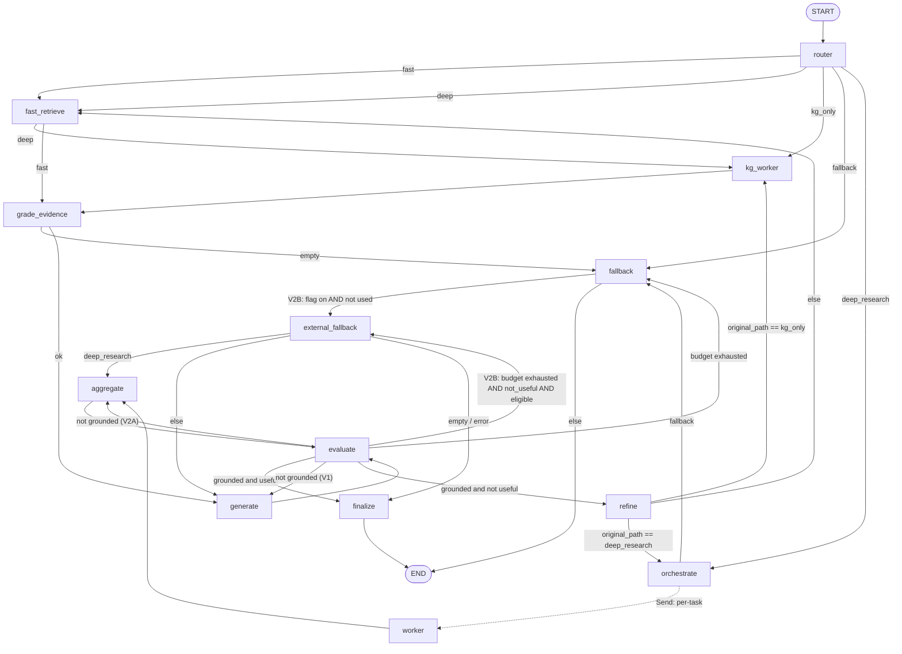
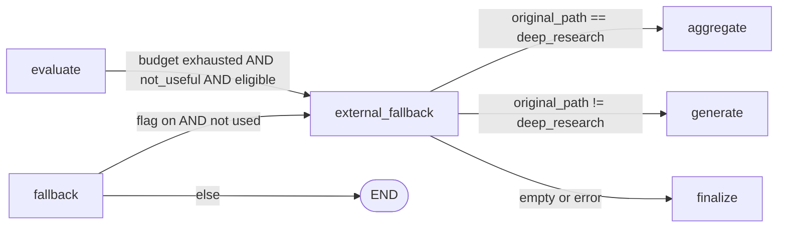

# Agent V2 — Deep Research + External Fallback Architecture

V2 is an **additive** extension of the V1 LangGraph agent. It is shipped in two
phases:

- **V2A (always on)**: a fifth route — `deep_research` — that decomposes complex
  questions into per-source worker tasks, fans them out in parallel via
  LangGraph's `Send` primitive, and synthesizes the results through an
  aggregator. V1 routes (`fast`, `deep`, `kg_only`, `fallback`) are preserved
  unchanged.
- **V2B (opt-in, off by default)**: an `external_fallback` node backed by the
  Tavily Search API, triggerable from two places (post-corpus-fallback and
  post-evaluator-budget-exhausted) with a hard one-pass guard. Provenance is
  preserved end-to-end so the model and the response can distinguish corpus
  evidence from web evidence.

This document covers:

1. [Why V2](#1-why-v2)
2. [Topology](#2-topology)
3. [State channels and reducers](#3-state-channels-and-reducers)
4. [Path-aware refine cycle](#4-path-aware-refine-cycle)
5. [Source-type canonicalization (V2A.0)](#5-source-type-canonicalization-v2a0)
6. [API surface](#6-api-surface)
7. [Configuration](#7-configuration)
8. [V2B external fallback](#8-v2b-external-fallback)
9. [Reference patterns](#9-reference-patterns)

---

## 1. Why V2

V1 covers the dominant single-shot question shapes (one fact -> one retrieval ->
one draft). It struggles when:

- The question implicitly requires **multi-source synthesis** — *"compare GraphRAG
  and HippoRAG using both the papers and the github repos"*.
- The question needs **per-source specialization** — papers want benchmark numbers,
  github wants concrete API/usage, instagram wants community signal.
- The orchestrator needs to **decompose** before retrieving — V1 retrieves on the
  raw user query and depends on a single-shot LLM to make sense of mixed corpora.

V2A solves these by adding three nodes (`orchestrate`, `worker`, `aggregate`) and
one route (`deep_research`). All other V1 nodes and channels are preserved
unchanged, so V1 routes still execute the same code paths.

---

## 2. Topology

### Mermaid view



### Per-route call shape

| Route             | Path                                                                              |
| :---------------- | :-------------------------------------------------------------------------------- |
| `fast`            | router -> fast_retrieve -> grade_evidence -> generate -> evaluate -> finalize     |
| `deep`            | router -> fast_retrieve -> kg_worker -> grade_evidence -> generate -> evaluate -> finalize |
| `kg_only`         | router -> kg_worker -> grade_evidence -> generate -> evaluate -> finalize         |
| `deep_research`   | router -> orchestrate -> Send N workers -> aggregate -> evaluate -> finalize      |
| `fallback`        | router -> fallback -> [V2B: external_fallback -> generate/aggregate -> evaluate] -> finalize |

The `deep_research` path **does not** run `grade_evidence` or `generate`; the
aggregator's grounding constraint already plays the role of evidence grading and
the aggregator IS the synthesizer.

---

## 3. State channels and reducers

V2A adds new channels to `AgentState` (`src/agent/state.py`) without changing V1
channels. The deep_research path uses **parallel-safe** accumulator channels with
a custom `add_or_reset` reducer; V1 channels remain **last-write-wins** so the
existing refine cycle (which clears them) keeps working.

| Channel                    | Reducer            | Purpose                                                  |
| :------------------------- | :----------------- | :------------------------------------------------------- |
| `evidence`                 | last-write-wins    | V1 retrieval hits (also V2A aggregator output mirror)    |
| `kg_findings`              | last-write-wins    | V1 KG findings (also V2A aggregator output mirror)       |
| `graded_evidence`          | last-write-wins    | V1 grade_evidence output                                 |
| `plan`                     | last-write-wins    | V2A `OrchestrationPlan`                                  |
| `worker_tasks`             | last-write-wins    | V2A list of `WorkerTask` (drives Send fan-out)           |
| `current_task`             | per-Send slice     | The task one worker invocation is processing             |
| `worker_results`           | `add_or_reset`     | Parallel-safe accumulator of `WorkerResult` per task     |
| `aggregated_evidence`      | `add_or_reset`     | Parallel-safe accumulator of evidence across workers     |
| `aggregated_kg_findings`   | `add_or_reset`     | Parallel-safe accumulator of KG findings across workers  |
| `original_path`            | last-write-wins    | Cached `RoutePath.value` for path-aware refine routing   |
| `agent_version`            | last-write-wins    | "v2" for V2A graphs (surfaced in `AgentResponse`)        |
| `external_used`            | last-write-wins    | V2B one-pass guard (set by `external_fallback`)          |

### `add_or_reset` semantics

```python
def add_or_reset(left, right):
    if right is None:           # explicit clear sentinel
        return []
    if not left:
        return list(right)
    return list(left) + list(right)
```

Workers append: `{"worker_results": [single_result]}`. The refine node clears all
three accumulators with `{"worker_results": None, ...}` so the next research
cycle starts clean.

---

## 4. Path-aware refine cycle

V1's refine cycle clears evidence and re-routes to either `fast_retrieve` or
`kg_worker`. V2A extends this by:

1. **Caching the original path** in `state["original_path"]` at the router node.
   This survives subsequent state mutations (the refine node clears `route` /
   `evidence`, but not `original_path`).
2. **Clearing V2 accumulators** in the refine node via the `add_or_reset` None
   sentinel, plus clearing `plan` and `worker_tasks` so the orchestrator
   re-decomposes against the refined query.
3. **Path-aware dispatch** in `route_after_refine`:
   - `original_path == deep_research` -> `orchestrate`
   - `original_path == kg_only`       -> `kg_worker`
   - else                             -> `fast_retrieve`

The evaluator's "not grounded" branch is also path-aware: on `deep_research` it
re-runs `aggregate` (re-synthesize from the existing worker pool) instead of
`generate`. This keeps the regenerate budget meaningful on both paths.

---

## 5. Source-type canonicalization (V2A.0)

V1 used `arxiv` as the agent-side `SourceType` value, but the legacy DB stores
`research_paper` in the `source_types.name` column. This caused two silent bugs:

1. Passing `source_filter="arxiv"` to `hybrid_search` produced
   `"Source type 'arxiv' not found"` in the legacy logs and **applied no filter**.
2. Retrieval rows with `source_type='research_paper'` were demoted to `"unknown"`
   by the agent's `_coerce_source` function.

V2A.0 fixes this:

- Canonical `SourceType = Literal["research_paper", "github", "instagram", "kg",
  "external", "unknown"]`.
- `normalize_source_type()` plus a Pydantic `field_validator(mode="before")` on
  `Evidence.source_type` and `AgentRequest.source_filter` /
  `WorkerTask.source_filter` quietly normalize aliases (`arxiv`, `paper`,
  `research paper`, `git`, `ig`, ...).
- `tools/retrieval.py::_coerce_source` consults the same normalizer.

V1 callers that pass `"arxiv"` continue to work; values are normalized to
`research_paper` at the input boundary.

---

## 6. API surface

### Request additions

```jsonc
{
  "query": "compare GraphRAG and HippoRAG across papers and code",
  "thread_id": "chat-001",
  "source_filter": "arxiv",            // alias normalized to research_paper
  "mode": "deep_research",             // new: auto | fast | deep | deep_research | kg_only
  "include_plan": true,                // new: surface OrchestrationPlan in response
  "include_workers": true              // new: surface per-worker structured outputs
}
```

When `mode != "auto"`, the service pre-populates `state["route"]` so the router
node short-circuits the LLM call (the trace shows `(override)` in the detail).

### Response additions

```jsonc
{
  "answer": "...",
  "route": "deep_research",
  "agent_version": "v2",
  "external_used": false,              // V2B will flip when Tavily augments
  "plan": {                            // present iff include_plan=true
    "summary": "...",
    "decomposition_rationale": "...",
    "tasks": [
      {"task_id": "t1", "worker_type": "paper", "query": "...", ...}
    ]
  },
  "worker_results": [                  // present iff include_workers=true
    {
      "task_id": "t1",
      "worker_type": "paper",
      "status": "ok",
      "output": {"key_points": ["..."], "analysis": "...", "confidence": "high"},
      "evidence": [...],
      "kg_findings": []
    }
  ],
  "trace": [
    {"node": "router", "duration_ms": 12.3, "detail": "deep_research: ..."},
    {"node": "orchestrate", "duration_ms": 410.0, "detail": "3 task(s): [paper,github,kg]"},
    {"node": "worker:paper", "duration_ms": 712.0, "detail": "..."},
    {"node": "worker:github", "duration_ms": 689.0, "detail": "..."},
    {"node": "worker:kg",     "duration_ms":  88.0, "detail": "..."},
    {"node": "aggregate",     "duration_ms": 980.0, "detail": "..."},
    {"node": "evaluate",      "duration_ms":  74.0, "detail": "..."},
    {"node": "finalize",      "duration_ms":   0.5, "detail": "..."}
  ]
}
```

The blueprint serializes with `exclude_none=True` so V1 callers do not see new
optional fields they did not request.

### CLI

```bash
python run_agent.py --query "compare GraphRAG and HippoRAG" \
                    --mode deep_research \
                    --include-plan --include-workers \
                    --pretty
```

---

## 7. Configuration

V2 adds six env vars (read by `src/agent/config.py`):

| Env var                          | Default | Purpose                                                                |
| :------------------------------- | :------ | :--------------------------------------------------------------------- |
| `AGENT_GRAPH_VERSION`            | `v2`    | Surfaced in `AgentResponse.agent_version`. Currently informational.    |
| `AGENT_MAX_WORKERS`              | `4`     | Upper bound on Send fan-out per `deep_research` orchestration.         |
| `AGENT_WORKER_TOP_K`             | `5`     | Per-task `top_k` for the worker retrieval primitives.                  |
| `AGENT_ALLOW_EXTERNAL_FALLBACK`  | `false` | V2B opt-in flag. When true the graph may invoke `external_fallback`.   |
| `AGENT_TAVILY_API_KEY`           | (none)  | Required when the V2B flag is on. The service fails fast at startup.   |
| `AGENT_EXTERNAL_FALLBACK_TOPK`   | `5`     | Number of Tavily hits to retrieve per external pass.                   |

V1 env vars (`AGENT_TOP_K`, `AGENT_KG_TOP_K`, `AGENT_MAX_REFINEMENT_LOOPS`,
`AGENT_MAX_REGENERATE_LOOPS`, `AGENT_CHECKPOINT_DB`, `AGENT_REQUIRE_EVIDENCE`)
remain unchanged.

---

## 8. V2B external fallback

V2B introduces a single new node — `external_fallback` — that wraps the Tavily
Search API. It is **off by default**. The agent never silently invokes external
search; both the operator (`AGENT_ALLOW_EXTERNAL_FALLBACK=true`) and the runtime
(`should_external_fallback(state)`) must agree before the node runs, and there
is a hard one-pass guard so it can never run twice in a single agent turn.

### 8.1 Why dual trigger?

Two distinct failure shapes call for two distinct entry points:

1. **Corpus thin from the start** — the router selects `fallback` (out-of-scope)
   or `grade_evidence` drops every chunk. Without V2B the run terminates with
   the V1 "insufficient evidence" template. With V2B the graph hands off to
   `external_fallback` first; if Tavily returns useful evidence, the run
   re-enters the regular synthesis path (`generate` for V1 routes,
   `aggregate` for `deep_research`).
2. **Budget exhausted on a not-useful answer** — the corpus had material but
   the generated/aggregated draft does not actually address the question, and
   the refinement loop is spent. Triggering external from `route_after_evaluate`
   gives the agent one final attempt with a different evidence pool before
   accepting defeat.

### 8.2 Topology of the V2B layer



### 8.3 Hard contract

The `external_fallback` node provides four guarantees:

1. **One pass per run.** `state["external_used"]` is flipped to `True` *before*
   any conditional re-entry, so neither the post-fallback edge nor the
   post-evaluate edge can route to `external_fallback` a second time, even
   across refine cycles.
2. **Honest failure.** If the SDK is missing, the API key is missing, or
   Tavily errors / returns nothing usable, the node sets
   `insufficient_evidence=True` and routes to `finalize` with a synthesized
   "neither corpus nor external returned usable evidence" draft. There is no
   silent degradation to a corpus-only answer.
3. **Provenance preserved.** Every `Evidence` emitted carries
   `provenance=Provenance.EXTERNAL` and `source_type="external"`. The
   aggregator and generator prompts render external evidence in a separate
   `[EXTERNAL]` block and explicitly mark it as lower trust. The model is
   instructed to flag external citations in prose ("according to the web
   search results, ...").
4. **Path-aware re-entry.** `route_after_external_fallback` dispatches to
   `aggregate` for `deep_research` runs (so the existing worker pool is
   re-synthesized over the augmented evidence union) and to `generate`
   everywhere else (V1 single-shot answer with corpus + external evidence).

### 8.4 Response shape

When V2B fires, the response carries:

- `external_used: true`
- `evidence_used` includes Evidence chunks with `provenance: "external"` and
  `source_type: "external"`. Their `url` and `title` come from Tavily, and
  `content_id` is a deterministic `tavily:<sha1-prefix>` hash of the URL so
  the aggregator's dedupe key (`(content_id, chunk_index)`) stays stable.
- `trace` contains an `external_fallback` step with `status` in
  `{ok, empty, error}` and a detail string of the form
  `external_n=2 corpus_n=0 merged_graded_n=2`.

### 8.5 Hard-fail at startup, not at runtime

`AgentSettings.from_env()` raises `GraphCompileError` if the V2B flag is on
but no key is present:

```text
AGENT_ALLOW_EXTERNAL_FALLBACK=true but AGENT_TAVILY_API_KEY is not set.
Set the key or disable the flag — the agent refuses to silently disable
external fallback.
```

This catches misconfiguration during process boot rather than at the first
out-of-corpus query, where it would otherwise look like a runtime
recovery failure.

---

## 9. Reference patterns

| Pattern                                | Reference                                                            |
| :------------------------------------- | :------------------------------------------------------------------- |
| Router with sharper 5-path taxonomy    | `02-cognito-crag/graph/chains/router.py`                             |
| Orchestrator decomposes into N tasks   | `06-langgraph-orchestration/app/agents/planner.py`                   |
| `Send` per-task fan-out                | LangGraph map-reduce docs + `06-langgraph-orchestration/app/graph/`  |
| Source-specialized analysis prompts    | `06-langgraph-orchestration/app/agents/worker.py`                    |
| Aggregator-as-synthesizer              | `06-langgraph-orchestration/app/agents/aggregator.py`                |
| 3-way self-reflection edge (preserved) | `02-cognito-crag/graph/graph.py`                                     |
| `_ensure_tasks` no-halt fallback       | `06-langgraph-orchestration/app/graph/nodes.py`                      |
| Path-aware refine cycle                | V2A original (extends `02-cognito-crag` refine pattern)              |
